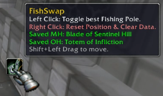
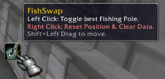
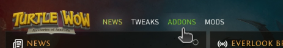

# FishSwap (Turtle WoW / 1.12.1)

**FishSwap** is a lightweight, "micro-addon" designed specifically for the Vanilla WoW (1.12.1) client used by Turtle WoW. 

It solves the classic problem of swapping between a 2-Handed Fishing Pole and a Main Hand + Shield/Off-Hand setup without losing your gear or getting "bag full" errors.

## Features

* **Smart Weapon Caching:** Instantly remembers exactly which Main Hand and Off-Hand items you are wearing before equipping your pole. It does not require you to set up a "combat outfit" manually.

* **Best-in-Slot Detection:** The addon automatically scans every item in your bags and parses the tooltips to find the fishing pole with the highest `+Fishing` bonus. If you have a standard pole and a +20 pole, it will equip the +20 one.
* **Safety First:** Before un-equipping your weapons, FishSwap checks if you have enough free bag space (at least 2 slots) to safely store your current gear. If your bags are too full, it aborts the swap to prevent items from getting stuck on your cursor.
* **Persistence:** Your cached weapon data is saved to `SavedVariables`. You can equip your pole, log out for the night, and when you log back in, the button will still remember which sword and shield to put back on.
* **Zero Configuration:** Just install and click.

## Installation

### Method 1: Turtle WoW Launcher (Recommended)
1. Select the **ADDONS** tab in the Turtle WoW launcher.

2. Click **+ Add new addon** at the bottom of the list.

3. Enter the following URL: https://github.com/Draiscor/FishSwap.git
4. Click the **Install** button.

### Method 2: Manual Installation
1. Download the latest release from the [Releases Page](../../releases).
2. Navigate to your WoW directory: `\WoW_Directory\Interface\AddOns\`.
3. Create a folder named `FishSwap`.
4. Place `FishSwap.toc` and `FishSwap.lua` inside this folder.
5. Launch the game.

## Usage

A small button with a fishing icon will appear in the centre of your screen.

| Action | Function |
| :--- | :--- |
| **Left Click** | **Toggle Gear.**   1. Saves current weapons & equips best Fishing Pole.  2. Click again to re-equip the saved weapons. |
| **Shift + Drag** | **Move Button.**   Hold Shift and use the Left Mouse Button to drag the icon to your desired location on the UI. |
| **Right Click** | **Full Reset.**   Resets the button to the centre of the screen and **clears** all saved weapon data. Use this if the addon gets out of sync. |

### Chat Commands

* `/fishswap reset` — Resets the button position to the centre of the screen (does **not** clear weapon data). Use this if you have lost the button off-screen.

## Compatibility

* **Target Client:** World of Warcraft 1.12.1 (Vanilla).
* **Tested On:** Turtle WoW.
* **Retail/Classic Era:** This version is **not** compatible with the modern WoW API (Dragonflight/Classic Era).